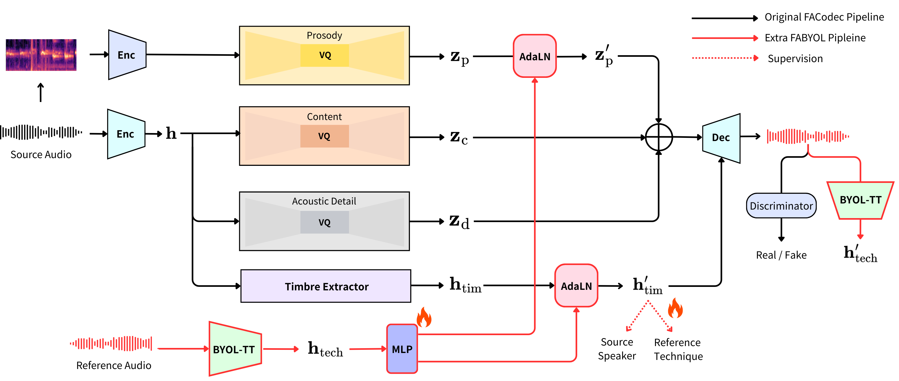

<link rel="stylesheet" href="/assets/css/style.css">

    

    

    

<h1>Abstract</h1>

Vocal timbral techniques—such as whisper, falsetto, and vocal fry scream—uniquely shape the spectral properties of the human voice, presenting a complex challenge for converting between them while preserving the original speaker’s identity. Traditional voice conversion methods, while effective at altering speaker identity or broad timbral qualities, often struggle to transform specialized timbral techniques without compromising speaker-specific traits. Similarly, existing style-transfer models, which are designed to capture broad categories like emotional expressiveness or singing styles, lack the necessary granularity to handle technique-specific variations. To address this, we propose FABYOL, a novel framework for timbral technique conversion built upon FACodec. FABYOL leverages supervised contrastive learning to generate embeddings that encode specific timbral techniques. These embeddings are then used to modulate timbre and prosody, enabling authentic technique conversion while preserving speaker identity. Experimental evaluation, using both tailored objective metrics and a user study, demonstrates that FABYOL achieves promising performance and offers significant improvements in fidelity and flexibility compared to state-of-the-art models. To support this task, we also introduce the EMO dataset, a high-quality, paired corpus developed with a specific focus on vocal fry scream. 
<figure>
  
</figure>

<h1>Timbral Technique Conversion</h1>

To evaluate the performance of FABYOL and baseline models in the timbral technique conversion task, we randomly select samples from the test set featuring unseen singers as both reference and source. The source audio, in a modal voice, is conditioned on the reference audio to convert it to the target timbral technique.

<h2>🎵 Falsetto Conversion</h2>

<h3>Unseen Speakers</h3>
<table class="reference-files">
  <thead>
    <tr>
      <th>Reference</th>
    </tr>
  </thead>
  <tbody>
    <tr>
      <td><audio controls src="audio/conversion/falsetto/1/ref_jvs001_falset10_BASIC5000_1635.wav"></audio></td>
    </tr>
  </tbody>
</table>
<h3></h3>
<table class="model-comparisons">
  <thead>
    <tr>
      <th>Source</th>
      <th>Ground Truth</th>
      <th>CosyVoice</th>
      <th>FreeVC</th>
      <th>FACodec</th>
      <th>FABYOL (Proposed)</th>
    </tr>
  </thead>
  <tbody>
    <tr>
      <td><audio controls src="audio/conversion/falsetto/1/source_jvs021_parallel100_VOICEACTRESS100_005.wav"></audio></td>
      <td><audio controls src="audio/conversion/falsetto/1/GT_jvs021_falset10_VOICEACTRESS100_005.wav"></audio></td>
      <td><audio controls src="audio/conversion/falsetto/1/COSYjvs021_parallel100_VOICEACTRESS100_005_to_falsetto_jvs001_falset10_BASIC5000_1635.wav"></audio></td>
      <td><audio controls src="audio/conversion/falsetto/1/Free_jvs021_parallel100_VOICEACTRESS100_005_to_falsetto_jvs001_falset10_BASIC5000_1635.wav"></audio></td>
      <td><audio controls src="audio/conversion/falsetto/1/ORI_jvs021_parallel100_VOICEACTRESS100_005_to_falsetto_jvs001_falset10_BASIC5000_1635.wav"></audio></td>
      <td><audio controls src="audio/conversion/falsetto/1/PRO_jvs021_parallel100_VOICEACTRESS100_005_to_falsetto_ref1_jvs001_falset10_BASIC5000_1635.wav"></audio></td>
    </tr>
  </tbody>
</table>

<h3></h3>
<table class="reference-files">
  <thead>
    <tr>
      <th>Reference</th>
    </tr>
  </thead>
  <tbody>
    <tr>
      <td><audio controls src="audio/conversion/falsetto/2/jvs019_falset10_VOICEACTRESS100_003.wav"></audio></td>
    </tr>
  </tbody>
</table>
<h3></h3>
<table class="model-comparisons">
  <thead>
    <tr>
      <th>Source</th>
      <th>Ground Truth</th>
      <th>CosyVoice</th>
      <th>FreeVC</th>
      <th>FACodec</th>
      <th>FABYOL (Proposed)</th>
    </tr>
  </thead>
  <tbody>
    <tr>
      <td><audio controls src="audio/conversion/falsetto/2/SOUCREjvs047_parallel100_VOICEACTRESS100_001.wav"></audio></td>
      <td><audio controls src="audio/conversion/falsetto/2/GT_jvs047_falset10_VOICEACTRESS100_001.wav"></audio></td>
      <td><audio controls src="audio/conversion/falsetto/2/COSY_jvs047_parallel100_VOICEACTRESS100_001_to_falsetto_jvs019_falset10_VOICEACTRESS100_003.wav"></audio></td>
      <td><audio controls src="audio/conversion/falsetto/2/FREE_jvs047_parallel100_VOICEACTRESS100_002_to_falsetto_jvs019_falset10_VOICEACTRESS100_003.wav"></audio></td>
      <td><audio controls src="audio/conversion/falsetto/2/ORI_jvs047_parallel100_VOICEACTRESS100_001_to_falsetto_jvs019_falset10_VOICEACTRESS100_003.wav"></audio></td>
      <td><audio controls src="audio/conversion/falsetto/2/FABYOL_jvs047_parallel100_VOICEACTRESS100_001_to_falsetto_ref2_jvs019_falset10_VOICEACTRESS100_003.wav"></audio></td>
    </tr>
  </tbody>
</table>

<h3>Seen Speakers</h3>
<table class="reference-files">
  <thead>
    <tr>
      <th>Reference</th>
    </tr>
  </thead>
  <tbody>
    <tr>
      <td><audio controls src="audio/conversion/falsetto/3/ref_jvs011_falset10_ONOMATOPEE300_038.wav"></audio></td>
    </tr>
  </tbody>
</table>
<h3></h3>
<table class="model-comparisons">
  <thead>
    <tr>
      <th>Source</th>
      <th>Ground Truth</th>
      <th>CosyVoice</th>
      <th>FreeVC</th>
      <th>FACodec</th>
      <th>FABYOL (Proposed)</th>
    </tr>
  </thead>
  <tbody>
    <tr>
      <td><audio controls src="audio/conversion/falsetto/3/src_jvs002_parallel100_VOICEACTRESS100_001.wav"></audio></td>
      <td><audio controls src="audio/conversion/falsetto/3/GT_jvs002_falset10_VOICEACTRESS100_001.wav"></audio></td>
      <td><audio controls src="audio/conversion/falsetto/3/cosy_jvs002_parallel100_VOICEACTRESS100_001_to_falsetto_jvs011_falset10_ONOMATOPEE300_038.wav"></audio></td>
      <td><audio controls src="audio/conversion/falsetto/3/free_jvs002_parallel100_VOICEACTRESS100_001_to_falsetto_jvs011_falset10_ONOMATOPEE300_038.wav"></audio></td>
      <td><audio controls src="audio/conversion/falsetto/3/FACodec_jvs002_parallel100_VOICEACTRESS100_001_to_falsetto_jvs011_falset10_ONOMATOPEE300_038.wav"></audio></td>
      <td><audio controls src="audio/conversion/falsetto/3/FABYOL_jvs002_parallel100_VOICEACTRESS100_001_to_falsetto_ref1_jvs011_falset10_ONOMATOPEE300_038.wav"></audio></td>
    </tr>
  </tbody>
</table>

<h3></h3>
<table class="reference-files">
  <thead>
    <tr>
      <th>Reference</th>
    </tr>
  </thead>
  <tbody>
    <tr>
      <td><audio controls src="audio/conversion/falsetto/4/ref_jvs37_falset10_ONOMATOPEE300_158.wav"></audio></td>
    </tr>
  </thead>
</table>
<h3></h3>
<table class="model-comparisons">
  <thead>
    <tr>
      <th>Source</th>
      <th>Ground Truth</th>
      <th>CosyVoice</th>
      <th>FreeVC</th>
      <th>FACodec</th>
      <th>FABYOL (Proposed)</th>
    </tr>
  </thead>
  <tbody>
    <tr>
      <td><audio controls src="audio/conversion/falsetto/4/src_jvs009_parallel100_VOICEACTRESS100_003.wav"></audio></td>
      <td><audio controls src="audio/conversion/falsetto/4/GT_jvs009_falset10_VOICEACTRESS100_003.wav"></audio></td>
      <td><audio controls src="audio/conversion/falsetto/4/cosy_jvs009_parallel100_VOICEACTRESS100_003_to_falsetto_jvs37_falset10_ONOMATOPEE300_158.wav"></audio></td>
      <td><audio controls src="audio/conversion/falsetto/4/free_jvs009_parallel100_VOICEACTRESS100_003_to_falsetto_jvs37_falset10_ONOMATOPEE300_158.wav"></audio></td>
      <td><audio controls src="audio/conversion/falsetto/4/FACodec)jvs009_parallel100_VOICEACTRESS100_002_to_falsetto_jvs37_falset10_ONOMATOPEE300_158.wav"></audio></td>
      <td><audio controls src="audio/conversion/falsetto/4/FABYOL_jvs009_parallel100_VOICEACTRESS100_002_to_falsetto_ref1_jvs011_falset10_ONOMATOPEE300_038.wav"></audio></td>
    </tr>
  </tbody>
</table>

<h2>🎵 Whisper Conversion</h2>
<h3>Unseen Speakers</h3>
<table class="reference-files">
  <thead>
    <tr>
      <th>Reference</th>
    </tr>
  </thead>
  <tbody>
    <tr>
      <td><audio controls src="audio/conversion/whisper/1/ref_jvs019_whisper10_TRAVEL1000_0391.wav"></audio></td>
    </tr>
  </tbody>
</table>

<h3></h3>
<table class="model-comparisons">
  <thead>
    <tr>
      <th>Source</th>
      <th>Ground Truth</th>
      <th>CosyVoice</th>
      <th>FreeVC</th>
      <th>FACodec</th>
      <th>FABYOL (Proposed)</th>
    </tr>
  </thead>
  <tbody>
    <tr>
      <td><audio controls src="audio/conversion/whisper/1/jvs025_parallel100_VOICEACTRESS100_002.wav"></audio></td>
      <td><audio controls src="audio/conversion/whisper/1/GT_jvs025_whisper10_VOICEACTRESS100_002.wav"></audio></td>
      <td><audio controls src="audio/conversion/whisper/1/COSY_jvs025_parallel100_VOICEACTRESS100_002_to_whisper_jvs019_whisper10_TRAVEL1000_0391.wav"></audio></td>
      <td><audio controls src="audio/conversion/whisper/1/FREE_jvs025_parallel100_VOICEACTRESS100_001_to_whisper_jvs019_whisper10_TRAVEL1000_0391.wav"></audio></td>
      <td><audio controls src="audio/conversion/whisper/1/ORI_jvs025_parallel100_VOICEACTRESS100_002_to_whisper_jvs019_whisper10_TRAVEL1000_0391.wav"></audio></td>
      <td><audio controls src="audio/conversion/whisper/1/PRO_jvs025_parallel100_VOICEACTRESS100_002_to_whisper_ref2_jvs019_whisper10_TRAVEL1000_0391.wav"></audio></td>
    </tr>
  </tbody>
</table>

<h3></h3>
<table class="reference-files">
  <thead>
    <tr>
      <th>Reference</th>
    </tr>
  </thead>
  <tbody>
    <tr>
      <td><audio controls src="audio/conversion/whisper/2/ref_jvs001_whisper10_BASIC5000_1140.wav"></audio></td>
    </tr>
  </tbody>
</table>
<h3></h3>
<table class="model-comparisons">
  <thead>
    <tr>
      <th>Source</th>
      <th>Ground Truth</th>
      <th>CosyVoice</th>
      <th>FreeVC</th>
      <th>FACodec</th>
      <th>FABYOL (Proposed)</th>
    </tr>
  </thead>
  <tbody>
    <tr>
      <td><audio controls src="audio/conversion/whisper/2/jvs021_parallel100_VOICEACTRESS100_003.wav"></audio></td>
      <td><audio controls src="audio/conversion/whisper/2/GT_jvs021_whisper10_VOICEACTRESS100_003.wav"></audio></td>
      <td><audio controls src="audio/conversion/whisper/2/COSY_jvs021_parallel100_VOICEACTRESS100_003_to_whisper_jvs001_whisper10_BASIC5000_1140.wav"></audio></td>
      <td><audio controls src="audio/conversion/whisper/2/FREE_jvs021_parallel100_VOICEACTRESS100_003_to_whisper_jvs001_whisper10_BASIC5000_1140.wav"></audio></td>
      <td><audio controls src="audio/conversion/whisper/2/ORI_jvs021_parallel100_VOICEACTRESS100_003_to_whisper_jvs001_whisper10_BASIC5000_1140.wav"></audio></td>
      <td><audio controls src="audio/conversion/whisper/2/PRO_jvs021_parallel100_VOICEACTRESS100_003_to_whisper_ref1_jvs001_whisper10_BASIC5000_1140.wav"></audio></td>
    </tr>
  </tbody>
</table>

<h3>Seen Speakers</h3>
<table class="reference-files">
  <thead>
    <tr>
      <th>Reference</th>
    </tr>
  </thead>
  <tbody>
    <tr>
      <td><audio controls src="audio/conversion/whisper/3/ref_jvs011_whisper10_BASIC5000_0401.wav"></audio></td>
    </tr>
  </tbody>
</table>

<h3></h3>
<table class="model-comparisons">
  <thead>
    <tr>
      <th>Source</th>
      <th>Ground Truth</th>
      <th>CosyVoice</th>
      <th>FreeVC</th>
      <th>FACodec</th>
      <th>FABYOL (Proposed)</th>
    </tr>
  </thead>
  <tbody>
    <tr>
      <td><audio controls src="audio/conversion/whisper/3/src_jvs002_parallel100_VOICEACTRESS100_001.wav"></audio></td>
      <td><audio controls src="audio/conversion/whisper/3/GT_jvs002_whisper10_VOICEACTRESS100_001.wav"></audio></td>
      <td><audio controls src="audio/conversion/whisper/3/cosy_jvs002_parallel100_VOICEACTRESS100_001_to_whisper_jvs011_whisper10_BASIC5000_0401.wav"></audio></td>
      <td><audio controls src="audio/conversion/whisper/3/free_jvs002_parallel100_VOICEACTRESS100_001_to_whisper_jvs011_whisper10_BASIC5000_0401.wav"></audio></td>
      <td><audio controls src="audio/conversion/whisper/3/facodec_jvs002_parallel100_VOICEACTRESS100_001_to_whisper_jvs011_whisper10_BASIC5000_0401.wav"></audio></td>
      <td><audio controls src="audio/conversion/whisper/3/fabyoljvs002_parallel100_VOICEACTRESS100_001_to_whisper_ref1_jvs011_whisper10_BASIC5000_0401.wav"></audio></td>
    </tr>
  </tbody>
</table>

<h3></h3>
<table class="reference-files">
  <thead>
    <tr>
      <th>Reference</th>
    </tr>
  </thead>
  <tbody>
    <tr>
      <td><audio controls src="audio/conversion/whisper/4/ref_jvs37_whisper10_TRAVEL1000_0431.wav"></audio></td>
    </tr>
  </tbody>
</table>

<h3></h3>
<table class="model-comparisons">
  <thead>
    <tr>
      <th>Source</th>
      <th>Ground Truth</th>
      <th>CosyVoice</th>
      <th>FreeVC</th>
      <th>FACodec</th>
      <th>FABYOL (Proposed)</th>
    </tr>
  </thead>
  <tbody>
    <tr>
      <td><audio controls src="audio/conversion/whisper/4/src_jvs004_parallel100_VOICEACTRESS100_002.wav"></audio></td>
      <td><audio controls src="audio/conversion/whisper/4/GT_jvs004_whisper10_VOICEACTRESS100_002.wav"></audio></td>
      <td><audio controls src="audio/conversion/whisper/4/cosy_jvs004_parallel100_VOICEACTRESS100_002_to_whisper_jvs37_whisper10_TRAVEL1000_0431.wav"></audio></td>
      <td><audio controls src="audio/conversion/whisper/4/free_jvs004_parallel100_VOICEACTRESS100_002_to_whisper_jvs37_whisper10_TRAVEL1000_0431.wav"></audio></td>
      <td><audio controls src="audio/conversion/whisper/4/facodec_jvs004_parallel100_VOICEACTRESS100_002_to_whisper_jvs37_whisper10_TRAVEL1000_0431.wav"></audio></td>
      <td><audio controls src="audio/conversion/whisper/4/fabyol_jvs004_parallel100_VOICEACTRESS100_002_to_whisper_ref2_jvs37_whisper10_TRAVEL1000_0431.wav"></audio></td>
    </tr>
  </tbody>
</table>

<h2>🎵 Scream Conversion</h2>
<h3>Unseen Speakers</h3>
<table class="reference-files">
  <thead>
    <tr>
      <th>Reference</th>
    </tr>
  </thead>
  <tbody>
    <tr>
      <td><audio controls src="audio/conversion/scream/1/ref_GeneraStudios_MetalScreams_110_AllTheThings_High.wav"></audio></td>
    </tr>
  </tbody>
</table>
<h3></h3>
<table class="model-comparisons">
  <thead>
    <tr>
      <th>Source</th>
      <th>Ground Truth</th>
      <th>CosyVoice</th>
      <th>FreeVC</th>
      <th>FACodec</th>
      <th>FABYOL (Proposed)</th>
    </tr>
  </thead>
  <tbody>
    <tr>
      <td><audio controls src="audio/conversion/scream/1/Jun_clean_01.wav"></audio></td>
      <td><audio controls src="audio/conversion/scream/1/GT_Jun_scream_01.wav"></audio></td>
      <td><audio controls src="audio/conversion/scream/1/COSYJun_clean_01_to_scream_GeneraStudios_MetalScreams_110_AllTheThings_High.wav"></audio></td>
      <td><audio controls src="audio/conversion/scream/1/Jun_clean_01_to_scream_GeneraStudios_MetalScreams_110_AllTheThings_High.wav"></audio></td>
      <td><audio controls src="audio/conversion/scream/1/ORI_Jun_clean_01_to_scream_GeneraStudios_MetalScreams_110_AllTheThings_High.wav"></audio></td>
      <td><audio controls src="audio/conversion/scream/1/PRO_Jun_clean_01_to_scream_ref1_GeneraStudios_MetalScreams_110_AllTheThings_High.wav"></audio></td>
    </tr>
  </tbody>
</table>
<h3></h3>

<table class="reference-files">
  <thead>
    <tr>
      <th>Reference</th>
    </tr>
  </thead>
  <tbody>
    <tr>
      <td><audio controls src="audio/conversion/scream/2/ref_GeneraStudios_MetalScreams_110_WeAreTheHate.wav"></audio></td>
    </tr>
  </tbody>
</table>
<h3></h3>
<table class="model-comparisons">
  <thead>
    <tr>
      <th>Source</th>
      <th>Ground Truth</th>
      <th>CosyVoice</th>
      <th>FreeVC</th>
      <th>FACodec</th>
      <th>FABYOL (Proposed)</th>
    </tr>
  </thead>
  <tbody>
    <tr>
      <td><audio controls src="audio/conversion/scream/2/Wayne_clean_01.wav"></audio></td>
      <td><audio controls src="audio/conversion/scream/2/GT_Wayne_scream_01.wav"></audio></td>
      <td><audio controls src="audio/conversion/scream/2/COSY_Wayne_clean_01_to_scream_GeneraStudios_MetalScreams_110_WeAreTheHate.wav"></audio></td>
      <td><audio controls src="audio/conversion/scream/2/FREEWayne_clean_01_to_scream_GeneraStudios_MetalScreams_110_AllTheThings_High.wav"></audio></td>
      <td><audio controls src="audio/conversion/scream/2/ORI_Wayne_clean_01_to_scream_GeneraStudios_MetalScreams_110_WeAreTheHate.wav"></audio></td>
      <td><audio controls src="audio/conversion/scream/2/PRO_Wayne_clean_01_to_scream_ref1_GeneraStudios_MetalScreams_110_WeAreTheHate.wav"></audio></td>
    </tr>
  </tbody>
</table>

<h3>Seen Speakers</h3>
<table class="reference-files">
  <thead>
    <tr>
      <th>Reference</th>
    </tr>
  </thead>
  <tbody>
    <tr>
      <td><audio controls src="audio/conversion/scream/3/ref_tony_scream_349.wav"></audio></td>
    </tr>
  </tbody>
</table>
<h3></h3>
<table class="model-comparisons">
  <thead>
    <tr>
      <th>Source</th>
      <th>Ground Truth</th>
      <th>CosyVoice</th>
      <th>FreeVC</th>
      <th>FACodec</th>
      <th>FABYOL (Proposed)</th>
    </tr>
  </thead>
  <tbody>
    <tr>
      <td><audio controls src="audio/conversion/scream/3/src_tony_clean_352.wav"></audio></td>
      <td><audio controls src="audio/conversion/scream/3/GT_tony_scream_352.wav"></audio></td>
      <td><audio controls src="audio/conversion/scream/3/cosy_tony_clean_352_to_scream_tony_scream_349.wav"></audio></td>
      <td><audio controls src="audio/conversion/scream/3/free_tony_clean_352_to_scream_tony_scream_349.wav"></audio></td>
      <td><audio controls src="audio/conversion/scream/3/facodec_tony_clean_352_to_scream_tony_scream_349.wav"></audio></td>
      <td><audio controls src="audio/conversion/scream/3/fabyol_tony_clean_352_to_scream.wav"></audio></td>
    </tr>
  </tbody>
</table>
<h3></h3>

<table class="reference-files">
  <thead>
    <tr>
      <th>Reference</th>
    </tr>
  </thead>
  <tbody>
    <tr>
      <td><audio controls src="audio/conversion/scream/4/ref_tony_scream_349.wav"></audio></td>
    </tr>
  </tbody>
</table>
<h3></h3>
<table class="model-comparisons">
  <thead>
    <tr>
      <th>Source</th>
      <th>Ground Truth</th>
      <th>CosyVoice</th>
      <th>FreeVC</th>
      <th>FACodec</th>
      <th>FABYOL (Proposed)</th>
    </tr>
  </thead>
  <tbody>
    <tr>
      <td><audio controls src="audio/conversion/scream/4/src_tony_clean_353.wav"></audio></td>
      <td><audio controls src="audio/conversion/scream/4/GT_tony_scream_353.wav"></audio></td>
      <td><audio controls src="audio/conversion/scream/4/cosy_tony_clean_353_to_scream_tony_scream_349.wav"></audio></td>
      <td><audio controls src="audio/conversion/scream/4/free_tony_clean_353_to_scream_tony_scream_349.wav"></audio></td>
      <td><audio controls src="audio/conversion/scream/4/facodec_tony_clean_353_to_scream_tony_scream_349.wav"></audio></td>
      <td><audio controls src="audio/conversion/scream/4/fabyol_tony_clean_353_to_scream.wav"></audio></td>
    </tr>
  </tbody>
</table>

<h2>🎵 Modal Conversion</h2>
In the modal-to-modal conversion, we can better assess the model's ability to preserve the source speaker's identity.
<h3></h3>
<table class="reference-files">
  <thead>
    <tr>
      <th>Reference</th>
    </tr>
  </thead>
  <tbody>
    <tr>
      <td><audio controls src="audio/conversion/spksim/1/jvs019_parallel100_VOICEACTRESS100_099.wav"></audio></td>
    </tr>
  </tbody>
</table>

<h3></h3>
<table class="model-comparisons">
  <thead>
    <tr>
      <th>Source</th>
      <th>Ground Truth</th>
      <th>CosyVoice</th>
      <th>FreeVC</th>
      <th>FACodec</th>
      <th>FABYOL (Proposed)</th>
    </tr>
  </thead>
  <tbody>
    <tr>
      <td><audio controls src="audio/conversion/spksim/1/jvs034_parallel100_VOICEACTRESS100_002.wav"></audio></td>
      <td><audio controls src="audio/conversion/spksim/1/GT_jvs034_parallel100_VOICEACTRESS100_002.wav"></audio></td>
      <td><audio controls src="audio/conversion/spksim/1/COSY_jvs034_parallel100_VOICEACTRESS100_002_to_modal_jvs019_parallel100_VOICEACTRESS100_099.wav"></audio></td>
      <td><audio controls src="audio/conversion/spksim/1/FREE_jvs034_parallel100_VOICEACTRESS100_002_to_modal_jvs019_parallel100_VOICEACTRESS100_099.wav"></audio></td>
      <td><audio controls src="audio/conversion/spksim/1/ORI_jvs034_parallel100_VOICEACTRESS100_002_to_modal_jvs019_parallel100_VOICEACTRESS100_099.wav"></audio></td>
      <td><audio controls src="audio/conversion/spksim/1/PRO_jvs034_parallel100_VOICEACTRESS100_002_to_modal_ref2_jvs019_parallel100_VOICEACTRESS100_099.wav"></audio></td>
    </tr>
  </tbody>
</table>

<h3></h3>
<table class="reference-files">
  <thead>
    <tr>
      <th>Reference</th>
    </tr>
  </thead>
  <tbody>
    <tr>
      <td><audio controls src="audio/conversion/spksim/2/jvs001_parallel100_VOICEACTRESS100_091.wav"></audio></td>
    </tr>
  </tbody>
</table>

<h3></h3>
<table class="model-comparisons">
  <thead>
    <tr>
      <th>Source</th>
      <th>Ground Truth</th>
      <th>CosyVoice</th>
      <th>FreeVC</th>
      <th>FACodec</th>
      <th>FABYOL (Proposed)</th>
    </tr>
  </thead>
  <tbody>
    <tr>
      <td><audio controls src="audio/conversion/spksim/2/jvs066_parallel100_VOICEACTRESS100_004.wav"></audio></td>
      <td><audio controls src="audio/conversion/spksim/2/GT_jvs066_parallel100_VOICEACTRESS100_004.wav"></audio></td>
      <td><audio controls src="audio/conversion/spksim/2/COSY_jvs066_parallel100_VOICEACTRESS100_004_to_modal_jvs001_parallel100_VOICEACTRESS100_091.wav"></audio></td>
      <td><audio controls src="audio/conversion/spksim/2/FREE_jvs066_parallel100_VOICEACTRESS100_004_to_modal_jvs001_parallel100_VOICEACTRESS100_091.wav"></audio></td>
      <td><audio controls src="audio/conversion/spksim/2/ORI_jvs066_parallel100_VOICEACTRESS100_004_to_modal_jvs001_parallel100_VOICEACTRESS100_091.wav"></audio></td>
      <td><audio controls src="audio/conversion/spksim/2/PRO_jvs066_parallel100_VOICEACTRESS100_004_to_modal_ref1_jvs001_parallel100_VOICEACTRESS100_091.wav"></audio></td>
    </tr>
  </tbody>
</table>

<h1>Ablation Study</h1>
In this ablation study, we assess the significance of dual attribute modulation (timbre and prosody) in achieving authentic conversions. Additionally, we conduct another ablation study to evaluate the targeted augmentation strategy for timbral technique representation in contrastive learning.
<h2>Dual Modulation</h2>
<table class="model-comparisons">
  <thead>
    <tr>
      <th></th>
      <th>Falsetto</th>
      <th>Whisper</th>
      <th>Scream</th>
      <th>Modal</th>
    </tr>
  </thead>
  <tbody>
    <tr>
      <td>Ground Truth</td>
      <td><audio controls src="audio/conversion/falsetto/1/GT_jvs021_falset10_VOICEACTRESS100_005.wav"></audio></td>
      <td><audio controls src="audio/conversion/whisper/1/GT_jvs025_whisper10_VOICEACTRESS100_002.wav"></audio></td>
      <td><audio controls src="audio/conversion/scream/1/GT_Jun_scream_01.wav"></audio></td>
      <td><audio controls src="audio/conversion/spksim/1/GT_jvs034_parallel100_VOICEACTRESS100_002.wav"></audio></td>
    </tr>
    <tr>
      <td>w/o Prosody Modulation</td>
      <td><audio controls src="audio/conversion/DUAL/WOP_jvs021_parallel100_VOICEACTRESS100_005_to_falsetto_ref1_jvs001_falset10_BASIC5000_1635.wav"></audio></td>
      <td><audio controls src="audio/conversion/DUAL/WOP_jvs025_parallel100_VOICEACTRESS100_002_to_whisper_ref2_jvs019_whisper10_TRAVEL1000_0391.wav"></audio></td>
      <td><audio controls src="audio/conversion/DUAL/WOP_Jun_clean_01_to_scream_ref1_GeneraStudios_MetalScreams_110_AllTheThings_High.wav"></audio></td>
      <td><audio controls src="audio/conversion/DUAL/WOP_jvs034_parallel100_VOICEACTRESS100_002_to_modal_ref2_jvs019_parallel100_VOICEACTRESS100_099.wav"></audio></td>
    </tr>
    <tr>
      <td>Dula Modulation</td>
      <td><audio controls src="audio/conversion/falsetto/1/PRO_jvs021_parallel100_VOICEACTRESS100_005_to_falsetto_ref1_jvs001_falset10_BASIC5000_1635.wav"></audio></td>
      <td><audio controls src="audio/conversion/whisper/1/PRO_jvs025_parallel100_VOICEACTRESS100_002_to_whisper_ref2_jvs019_whisper10_TRAVEL1000_0391.wav"></audio></td>
      <td><audio controls src="audio/conversion/scream/1/PRO_Jun_clean_01_to_scream_ref1_GeneraStudios_MetalScreams_110_AllTheThings_High.wav"></audio></td>
      <td><audio controls src="audio/conversion/spksim/1/PRO_jvs034_parallel100_VOICEACTRESS100_002_to_modal_ref2_jvs019_parallel100_VOICEACTRESS100_099.wav"></audio></td>
    </tr>
  </tbody>
</table>

<h2>BYOL-TT Augmentations</h2>

<table class="model-comparisons">
  <thead>
    <tr>
      <th></th>
      <th>Falsetto</th>
      <th>Whisper</th>
      <th>Scream</th>
      <th>Modal</th>
    </tr>
  </thead>
  <tbody>
    <tr>
      <td>Ground Truth</td>
      <td><audio controls src="audio/conversion/falsetto/1/GT_jvs021_falset10_VOICEACTRESS100_005.wav"></audio></td>
      <td><audio controls src="audio/conversion/whisper/1/GT_jvs025_whisper10_VOICEACTRESS100_002.wav"></audio></td>
      <td><audio controls src="audio/conversion/scream/1/GT_Jun_scream_01.wav"></audio></td>
      <td><audio controls src="audio/conversion/spksim/1/GT_jvs034_parallel100_VOICEACTRESS100_002.wav"></audio></td>
    </tr>
    <tr>
      <td>DSP Augmentations</td>
      <td><audio controls src="audio/conversion/aug/DSP_jvs021_parallel100_VOICEACTRESS100_005_to_falsetto_ref1_jvs001_falset10_BASIC5000_1635.wav"></audio></td>
      <td><audio controls src="audio/conversion/aug/DSP_jvs025_parallel100_VOICEACTRESS100_002_to_whisper_ref2_jvs019_whisper10_TRAVEL1000_0391.wav"></audio></td>
      <td><audio controls src="audio/conversion/aug/DSP_Jun_clean_01_to_scream_ref1_GeneraStudios_MetalScreams_110_AllTheThings_High.wav"></audio></td>
      <td><audio controls src="audio/conversion/aug/DSP_jvs034_parallel100_VOICEACTRESS100_002_to_modal_ref2_jvs019_parallel100_VOICEACTRESS100_099.wav"></audio></td>
    </tr>
    <tr>
      <td>Real Data Selection</td>
      <td><audio controls src="audio/conversion/falsetto/1/PRO_jvs021_parallel100_VOICEACTRESS100_005_to_falsetto_ref1_jvs001_falset10_BASIC5000_1635.wav"></audio></td>
      <td><audio controls src="audio/conversion/whisper/1/PRO_jvs025_parallel100_VOICEACTRESS100_002_to_whisper_ref2_jvs019_whisper10_TRAVEL1000_0391.wav"></audio></td>
      <td><audio controls src="audio/conversion/scream/1/PRO_Jun_clean_01_to_scream_ref1_GeneraStudios_MetalScreams_110_AllTheThings_High.wav"></audio></td>
      <td><audio controls src="audio/conversion/spksim/1/PRO_jvs034_parallel100_VOICEACTRESS100_002_to_modal_ref2_jvs019_parallel100_VOICEACTRESS100_099.wav"></audio></td>
    </tr>
  </tbody>
</table>

